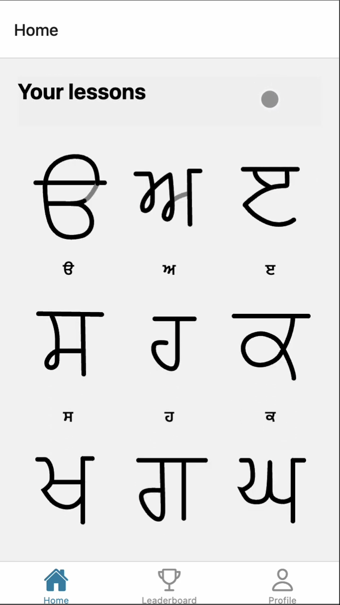
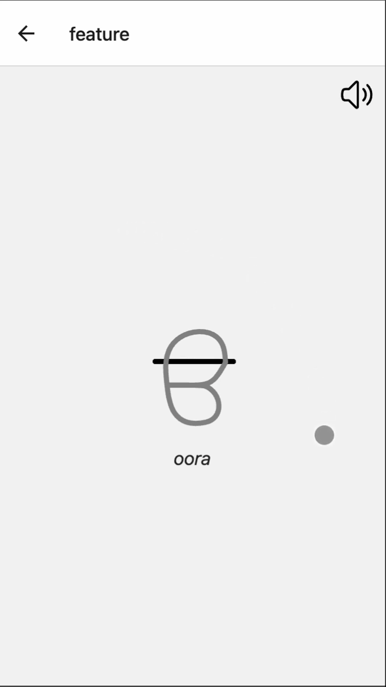
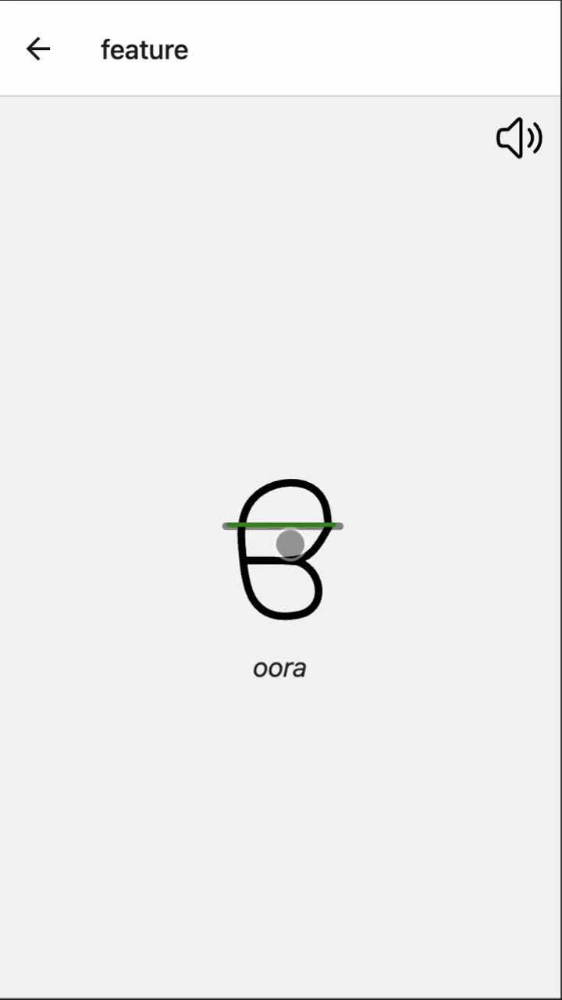
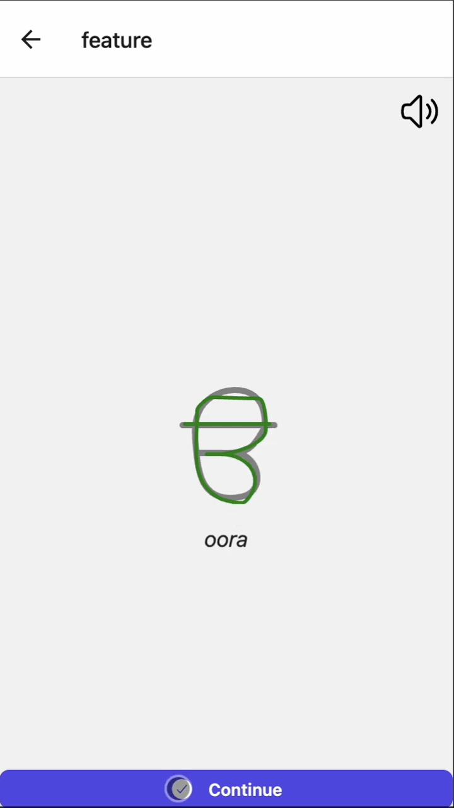
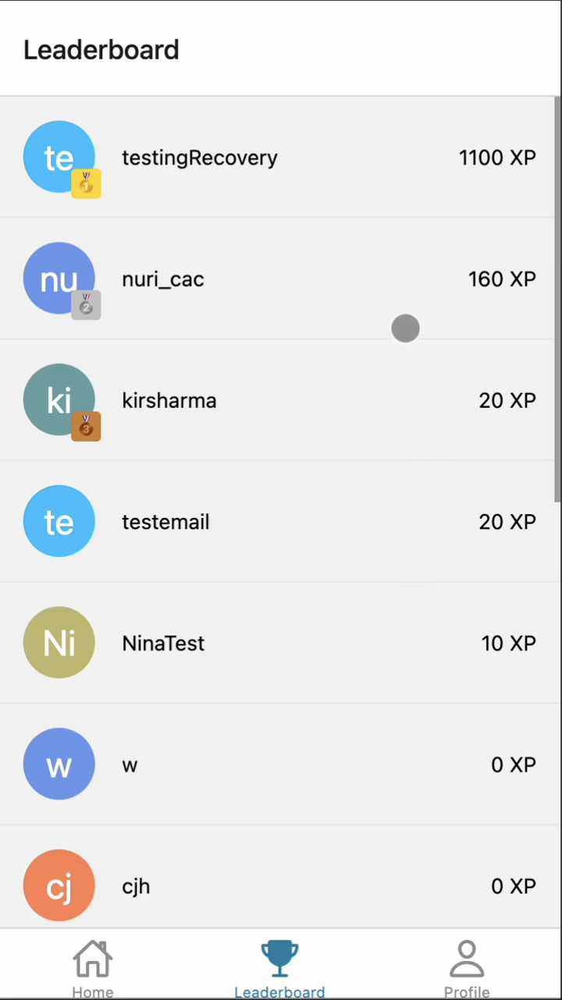
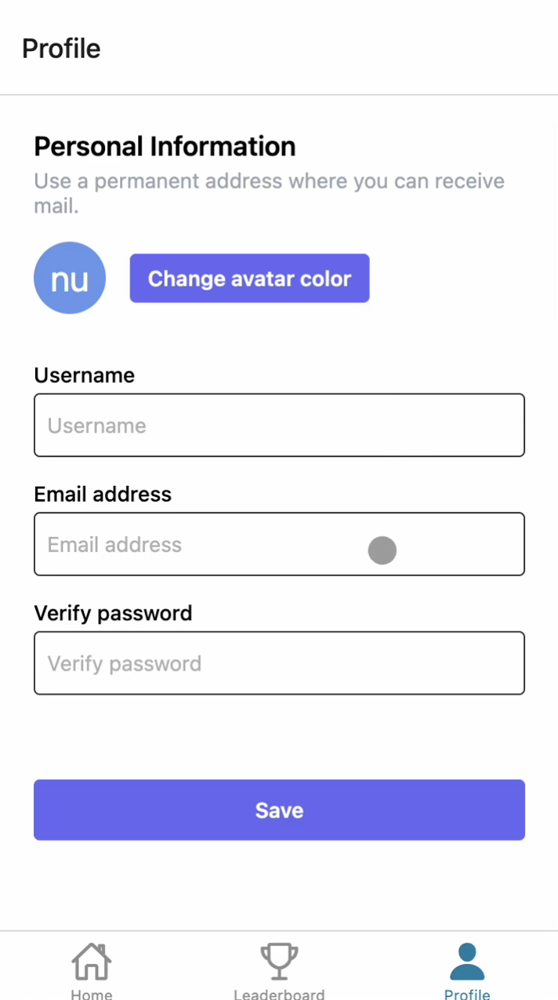

<div style="text-align: center; padding-top: 24pt; padding-bottom: 24pt;">
     
</div>

# GurmukhiTutor
GurmukhiTutor is a React Native app that teaches the Punjabi script Gurmukhi using handwriting tracing features and supplements it with gamification features. The app uses Firebase for the backend, enabling gamification features like user account creation, leaderboards, and XP systems.


## Features
* SVG stroke animations showing how a letter is to be written
* User account creation
* XP system
* Leaderboard system, enabling people to see other users
* Profile customization

## Screenshots
<div style="display: grid; grid-template-columns: repeat(3, 500px); grid-template-rows: repeat(2, 300px);">








</div>

## Video Demo
https://youtu.be/r2Qa-Un_pFI?si=A2Q_bgvDllIAiXXB

## Built With
* React Native
* Firebase
* TypeScript
* Node.js

## Setup
This app does require Firebase configurations that you must set-up on your own end.
1. Clone the repository. <br>
<code>git clone https://github.com/nurikimchi/GurmukhiTutor/</code>
2. Install dependencies. <br>
<code>npm install</code>
3. Create your environment file (```.env```). <br>
- Copy the ```.env.example``` file into <i>your</i> ```.env```. Here's the terminal command to do just that. <br> ```cp .env.example .env``` 
4. Generate your own test Firebase DB and copy those keys into your new ```.env``` file.
5. Run the app. ```npm run start```